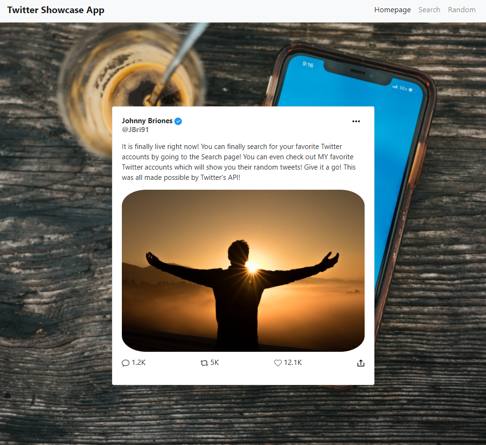

# Twitter Showcase App Created with React, Flask RESTful API, Bootstrap 4

Click [here](https://myflasktwitterapp.herokuapp.com/) to search for your favorite twitter accounts or tweet!

# Summary

This was my biggest application yet. I learned a lot as I was building this Twitter Showcase App. In order to get this to work, I used Twitter's API. Using that, there was a host of other things to keep in mind such as authentication. I learned FLask RESTful API in order to serve us the Twitter API to my React.js app. Being that Flask was in python, I had to learn the syntax to put it together. Along with that, I learned aboout endpoints and get requests. Within the get requests, I learned about implementing parameters and headers to get the data I needed.

Some of the challenges with this application was actually getting so much data and implementing 3 different pages while handling state from different places. With that, I was stuck for a while because I hit a roadblock and was not able to render the random information the way I wanted to. With a nudge from my mentors, I was able to rearrange the components to make things a lot cleaner and easier. Another challenge was the syntax of python. I have gotten so familiar with JavaScript that it wasn't until I created a few classes in my App.py file that I finally realized it was nothing more than just functions. From then on, it was a lot easier to pass over what I needed to my react App.

The final challenge was getting my app to be deployed on Heroku. There were a few things I needed to take care of in order for it to work being that it was a Flask App, React App and I used React Router as well. I hope to be exposed to this again so that I can learn it better. This was a fun app to put together.  

# Author
* Johnny Redry Briones Jr. - *Programmer*
* [LinkedIn](https://www.linkedin.com/in/johnny-briones-b6068383/)